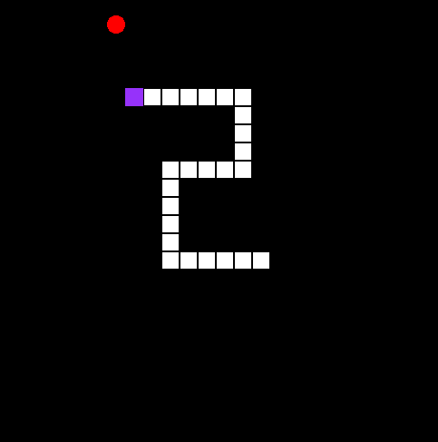

# Snake
Snake Game written using SFML in C++



**Controls**
Use arrow keys to control snake, `P` to pause/resume, and `Q` to quit.

## Prerequisites

Install GCC & make
```bash
$ sudo apt-get install build-essential
```

Install SFML (Debian based distros)

```bash
$ sudo apt-get install libsfml-dev
```

## Getting started
To compile the code, use
```bash
$ make
```

To run executable, use
```bash
$ make run
```

To clean build files, use
```bash
$ make clean
```